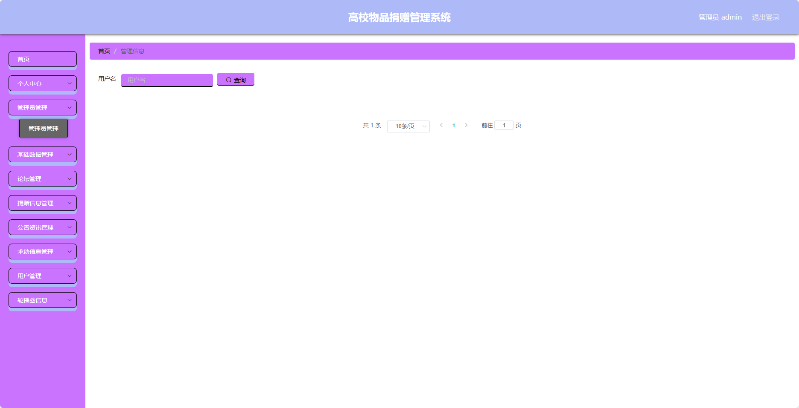

基于SpringBoot的高校物品捐赠管理系统（程序+论文）
=
- 完整代码获取地址：从戎源码网 ([https://armycodes.com/](https://armycodes.com/))
- 作者微信：19941326836  QQ：952045282 
- 承接计算机毕业设计、Java毕业设计、Python毕业设计、深度学习、机器学习
- 选题+开题报告+任务书+程序定制+安装调试+论文+答辩ppt 一条龙服务
- 所有选题地址https://github.com/nature924/allProject

一、项目介绍
---
基于Spring Boot框架实现的高校物品捐赠管理系统，系统包含两种角色：管理员、用户,系统分为前台和后台两大模块，主要功能如下。

### 前台功能：
- 首页：展示系统的概览信息、热门捐赠项目等内容。
- 论坛：供用户进行交流、分享心得、提问等活动。
- 公告资讯：查看系统发布的公告和相关资讯。
- 求助信息：浏览用户发布的求助信息。
- 个人中心：管理个人信息，包括查看个人捐赠记录、修改个人信息等操作。

### 后台功能：
- 个人中心：管理个人信息。
- 管理员管理：管理系统管理员信息，包括添加管理员、编辑管理员、删除管理员等操作。
- 基础数据管理：管理系统的基础数据，包括物品分类、捐赠地点等数据的添加、编辑、删除等操作。
- 论坛管理：管理论坛相关内容，包括审核帖子、删除帖子等操作。
- 捐赠信息管理：管理捐赠信息，包括发布捐赠信息、编辑捐赠信息、删除捐赠信息等操作。
- 公告资讯管理：管理系统公告信息，包括发布和管理公告信息等操作。
- 求助信息管理：管理用户发布的求助信息，包括审核求助信息、删除求助信息等操作。
- 用户管理：管理系统用户信息，包括查看用户列表、禁用用户等操作。
- 轮播图信息：管理首页轮播图信息，包括添加轮播图、编辑轮播图、删除轮播图等操作。

二、项目技术
---
- 编程语言：Java
- 数据库：MySQL
- 项目管理工具：Maven
- 前端技术：VUE、HTML、Jquery、Bootstrap
- 后端技术：Spring、SpringMVC、MyBatis

三、运行环境
---
- 操作系统：Windows、macOS都可以
- JDK版本：JDK1.8以上都可以
- 开发工具：IDEA、Ecplise、Myecplise都可以
- 数据库: MySQL5.7以上都可以
- Tomcat：任意版本都可以
- Maven：任意版本都可以

四、运行截图
---
### 论文截图：

### 程序截图：

